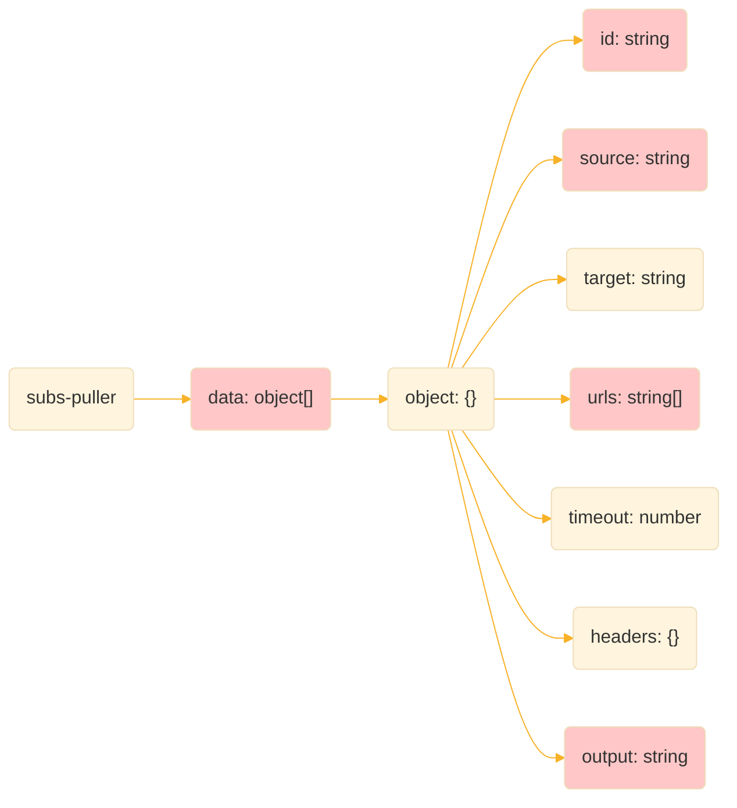

# subs-puller
A github action designed for fetching subscribe files.

## Example

```yaml
jobs:
  fetch-subcribe-files:
    runs-on: ubuntu-latest

    steps:
      - name: Fetch subscribe files
        uses: dongchengjie/subs-puller@v1
        with:
          repository: ${{ github.repository }}
          token: ${{ secrets.GITHUB_TOKEN }}
          config: https://raw.githubusercontent.com/dongchengjie/subs-puller/main/example.yaml

```

## Inputs

| Name       | Required | Description                                                  |
| ---------- | -------- | ------------------------------------------------------------ |
| repository | true     | Github repository(should contain both owner and repo)        |
| token      | true     | Github token(requires access to workflows. [GITHUB_TOKEN](https://docs.github.com/en/actions/security-guides/automatic-token-authentication#permissions-for-the-github_token) is sufficient.) |
| config     | true     | Subscribe files definition config url                        |

## Format

```yaml
data:
  - id: ChromeGo # 名称（必填）
    source: clash # 订阅类型（必填,支持clash、v2ray）
    target: v2ray # 转换订阅类型（详见：https://github.com/tindy2013/subconverter?tab=readme-ov-file#supported-types）
    urls: # url列表（必填）。多个订阅将合并为一个（要求source类型一致）
      - https://raw.githubusercontent.com/Alvin9999/pac2/master/clash.meta2/config.yaml
      - https://raw.githubusercontent.com/Alvin9999/pac2/master/clash.meta2/1/config.yaml
      - https://raw.githubusercontent.com/Alvin9999/pac2/master/clash.meta2/2/config.yaml
      - https://raw.githubusercontent.com/Alvin9999/pac2/master/clash.meta2/3/config.yaml
      - https://raw.githubusercontent.com/Alvin9999/pac2/master/clash.meta2/13/config.yaml
      - https://raw.githubusercontent.com/Alvin9999/pac2/master/clash.meta2/15/config.yaml
    timeout: 10000 # 连接超时（默认：10秒）
    headers: { 'User-Agent': 'clash' } # http响应头
    output: subs/ChromeGo.yaml # 保存到仓库路径（必填）
```



